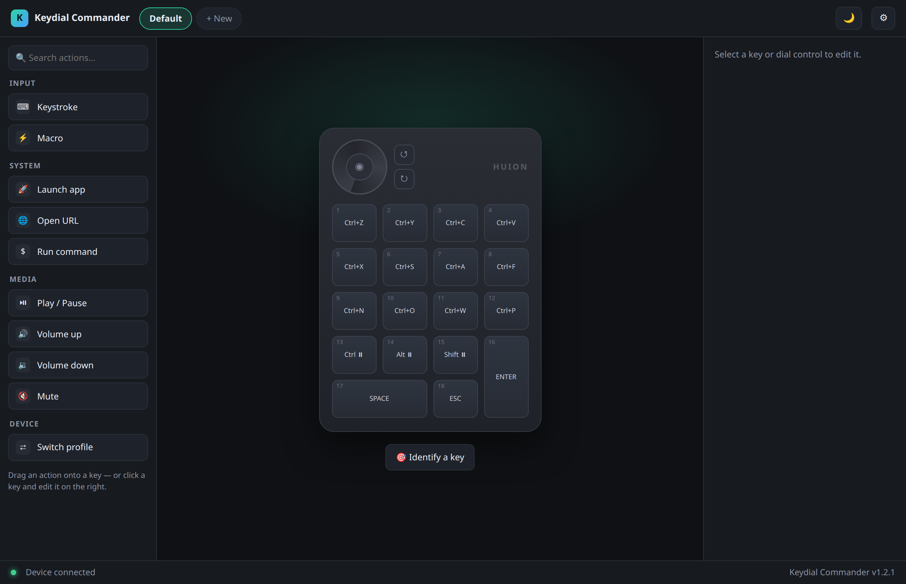
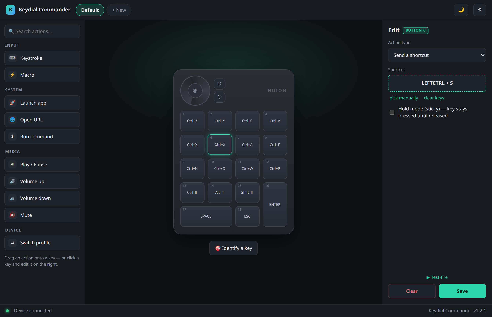
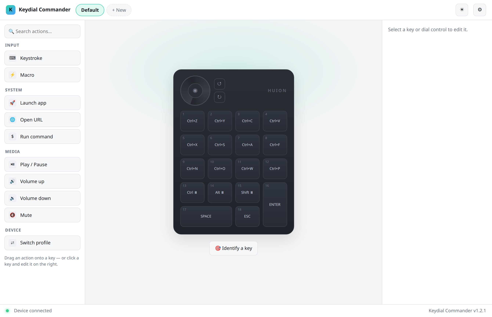

<div align="center">

# ⌨️ Keydial Commander

### Turn your Huion Keydial Mini (K20) into a Stream-Deck-style macro pad — on Linux.

Remap every button and the dial **visually** — to shortcuts, chords, macros, app launches, or
profile switches. No more being stuck with the fixed factory keys.




</div>

---

## ✨ What it does

- 🎛️ **Remap all 18 keys + the dial** — a picture of your device you click to configure
- ⌨️ **Shortcuts & chords** — `Ctrl+C`, `Ctrl+Shift+E`, anything — captured by just pressing them
- ⚡ **Macros** — multi-step key sequences with delays
- 🚀 **Launch apps / run commands / open URLs**
- 🗂️ **Profiles** — per-app layouts you switch in a click (or bind a key to switch)
- 🔴 **Live feedback** — keys light up as you press them; test-fire any action
- 🌗 **Dark & light themes**, drag-and-drop action library, and a real desktop app window
- 🐧 **Pure Linux, no root at runtime** — works over Bluetooth *and* USB

<table>
<tr>
<td width="50%"></td>
<td width="50%"></td>
</tr>
<tr>
<td align="center"><em>Click a key → assign any shortcut, macro, or command</em></td>
<td align="center"><em>Light or dark, follows your system</em></td>
</tr>
</table>

---

## 🚀 Quick start

```bash
# 1. Get it
git clone https://github.com/the3dcoder/KeydialCommander.git
cd KeydialCommander

# 2. Install the driver + service + device access, and build the app
#    (asks for sudo only for the system pieces; needs Node/npm for the UI)
make install-all
make build-web
make install-shell        # optional: adds a desktop app window + launcher

# 3. Start it (also auto-starts on login)
systemctl --user enable --now huion-keydial-mini-user.service
```

Then **pair your Keydial Mini over Bluetooth** (or plug it in via USB), and **open the app**:

> 🖱️ Launch **“Keydial Commander”** from your apps menu, run `keydial-commander`, or just visit
> **http://127.0.0.1:8137** in a browser.

Press a key — it lights up in the app. Click it, pick a shortcut, done. That's it. 🎉

---

## 🧠 How it works

The K20 is a standard Bluetooth/USB HID keyboard that sends fixed keystrokes. Keydial Commander:

1. **Grabs** the device at the Linux input layer (`evdev`), so the factory keys are suppressed;
2. **Maps** each physical control to an action you chose;
3. **Re-emits** it through a virtual `uinput` device.

It runs as a user-level service and serves the web UI locally. Same code path works for Bluetooth
and wired USB. See [`docs/DEVICE-K20.md`](docs/DEVICE-K20.md) for the verified hardware protocol.

> **Note:** `make install-udev` installs a udev rule granting your session access to the device
> and `/dev/uinput` — so **no `input`-group membership or root is needed at runtime**.

---

## 🛠️ Configure from the terminal (optional)

Everything the GUI does is also available via `keydialctl`:

```bash
keydialctl list-bindings                              # show current bindings
keydialctl list-keys                                  # all supported key names
keydialctl bind BUTTON_1 KEY_LEFTCTRL+KEY_C           # a shortcut
keydialctl bind --sticky BUTTON_13 KEY_LEFTCTRL       # hold-until-released modifier
keydialctl bind DIAL_CW KEY_VOLUMEUP                  # dial clockwise → volume up
keydialctl unbind BUTTON_1
keydialctl reset                                      # clear the active profile

keydialctl profile list                               # active profile marked with *
keydialctl profile create Krita --clone-from Default
keydialctl profile switch Krita
```

**Controls:** buttons are `BUTTON_1`–`BUTTON_18`; the dial is `DIAL_CW`, `DIAL_CCW`, `DIAL_CLICK`.
Combine buttons for chords (`BUTTON_1+BUTTON_2`).

**Action types:** `keystroke` (keys/chords, optional `sticky` hold), `macro` (steps + delays),
`command` (launch an app / run a program, no shell), and `profile_switch` (a profile name or
`"next"`).

---

## 🔌 Local API

The service exposes a local HTTP + WebSocket API on `127.0.0.1:8137` (this is what the GUI uses):

```bash
curl http://127.0.0.1:8137/api/status
curl -X PUT http://127.0.0.1:8137/api/profiles/Default/bindings/BUTTON_1 \
     -H 'Content-Type: application/json' -d '{"type":"keystroke","keys":["KEY_F9"]}'
```

Endpoints cover profiles CRUD, per-binding get/put/delete, dial sensitivity, YAML export/import,
`test-fire`, and a `/api/events` WebSocket streaming live key + device events.

---

## 🩺 Managing the service

```bash
systemctl --user status  huion-keydial-mini-user.service
systemctl --user restart huion-keydial-mini-user.service
journalctl --user -u     huion-keydial-mini-user.service -f
```

Profiles live in `~/.config/huion-keydial-mini/profiles/` (one YAML each) and every change persists
automatically.

---

## 🤝 Contributing

Contributions welcome — see [CONTRIBUTING.md](CONTRIBUTING.md) for the dev setup (Python driver +
`web/` Vite/React frontend), architecture, and workflow. More docs in [`docs/`](docs/):
[audit](docs/AUDIT-2026-07-19.md), [device protocol](docs/DEVICE-K20.md),
[roadmap](docs/ROADMAP.md).

## 📄 License

MIT — see [LICENSE](LICENSE). © 2026 Big Bwain LLC.

Built with [python-evdev](https://github.com/gvalkov/python-evdev),
[aiohttp](https://docs.aiohttp.org/), [Click](https://click.palletsprojects.com/),
[ruamel.yaml](https://yaml.readthedocs.io/), and
[React](https://react.dev/) + [Vite](https://vite.dev/) + [dnd-kit](https://dndkit.com/) +
[TanStack Query](https://tanstack.com/query).
